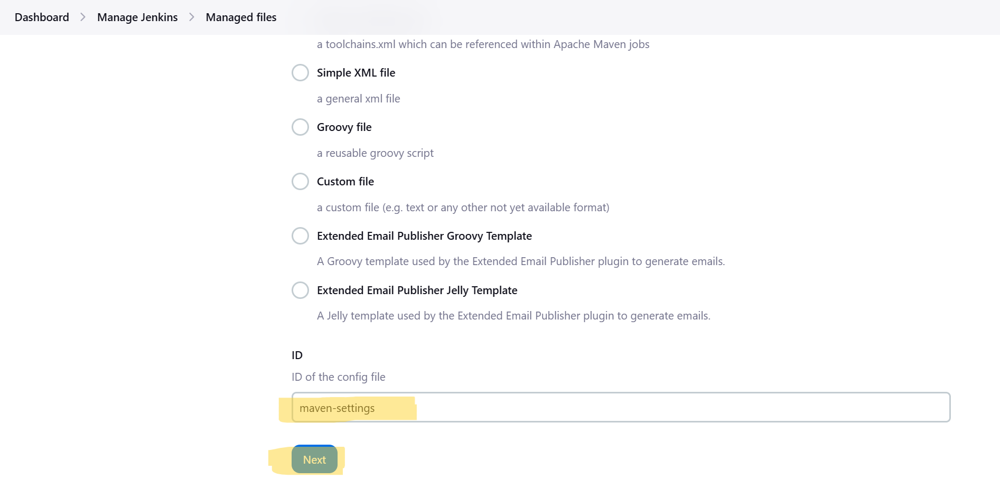

# Nexus & Jenkins Setup Guide

This guide will help you install and configure Nexus and integrate it with Jenkins for managing Maven repositories. Follow the steps below to ensure a smooth setup and integration.

## Installing Nexus

To install Nexus using Docker, run the following command:

```bash
docker run -d -p 8081:8081 --name nexus sonatype/nexus3
```

Alternatively, you can run it with custom memory parameters:

```bash
docker run -d -e INSTALL4J_ADD_VM_PARAMS="-Xms512m -Xmx512m" -p 8081:8081 --name nexus sonatype/nexus3
```

---

## Accessing Nexus

Once Nexus is running, you can access the web interface by navigating to:

```
http://<instance-ip>:8081
```

---

## Retrieving Admin Password

To retrieve the admin password for the first login, run the following command:

```bash
docker exec nexus cat /nexus-data/admin.password
```

---

## Configuring Maven Repositories

After logging in to Nexus, you'll need to configure the Maven `distributionManagement` settings in your `pom.xml`:

```xml
<distributionManagement>
    <repository>
        <id>maven-releases</id>
        <url>http://172.30.87.56:8081/repository/maven-releases/</url>
    </repository>
    <snapshotRepository>
        <id>maven-snapshots</id>
        <url>http://172.30.87.56:8081/repository/maven-snapshots/</url>
    </snapshotRepository>
</distributionManagement>
```


---

## Allowing Redeploy (Optional)

In Nexus, navigate to **Repositories** settings:

- For each hosted repository, under **Deployment Policies**, select:
  - **Allow Redeploy**

---

## Jenkins Setup

### Add Nexus Credentials

In Jenkins, follow these steps:
1. Install the plugin
        
2. Navigate to **Manage Jenkins** > **Managed Files** (provided by ConfigFile Provider plugin).
3. Add a new configuration file for **Global Maven settings.xml**.
        
4. Give any ID, for example: `maven-settings`.
         
5. Click **Next**.   

---

### Global Maven Configuration

Edit the `settings.xml` file as follows:
        
        

```xml
<server>
    <id>maven-releases</id>
    <username>admin</username>
    <password>admin</password>
</server>

<server>
    <id>maven-snapshots</id>
    <username>admin</username>
    <password>admin</password>
</server>
```

Replace `admin` with the actual credentials if they differ from default.

After editing, click **Submit**.

---

### Add Maven in Jenkins

To add Maven in Jenkins:

1. Go to **Manage Jenkins** > **Global Tool Configuration**.
2. Scroll down to the **Maven** section.
3. Add Maven if it's not already present by specifying the Maven version or installing it automatically.

    
    

---